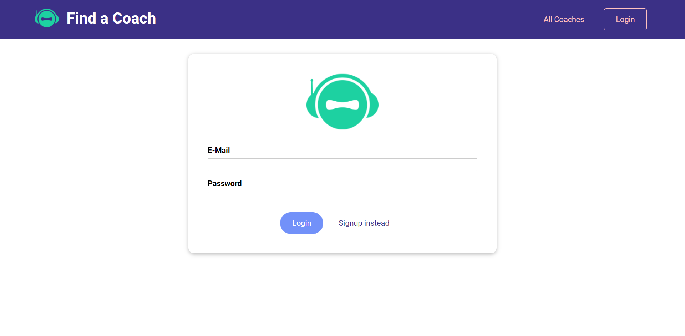
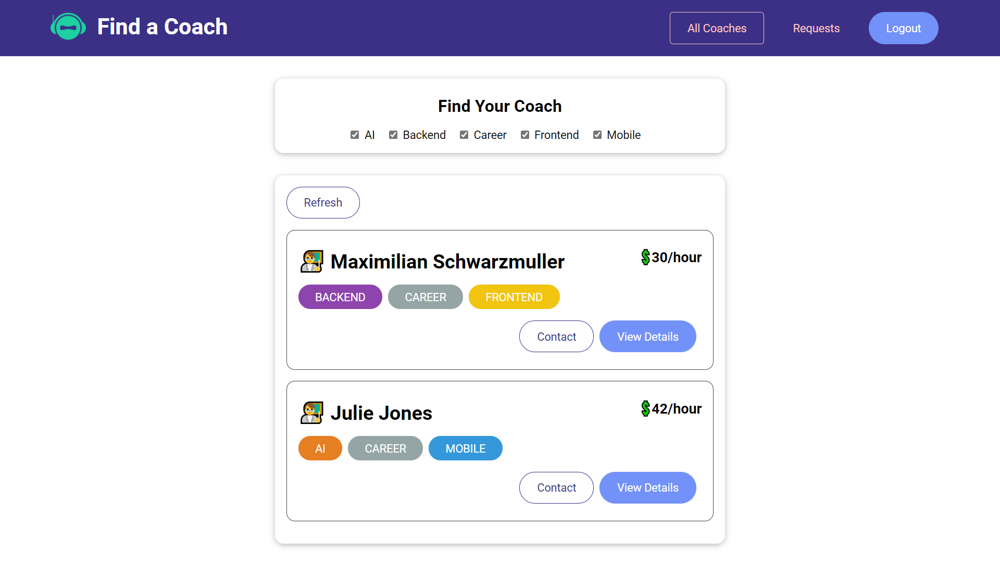
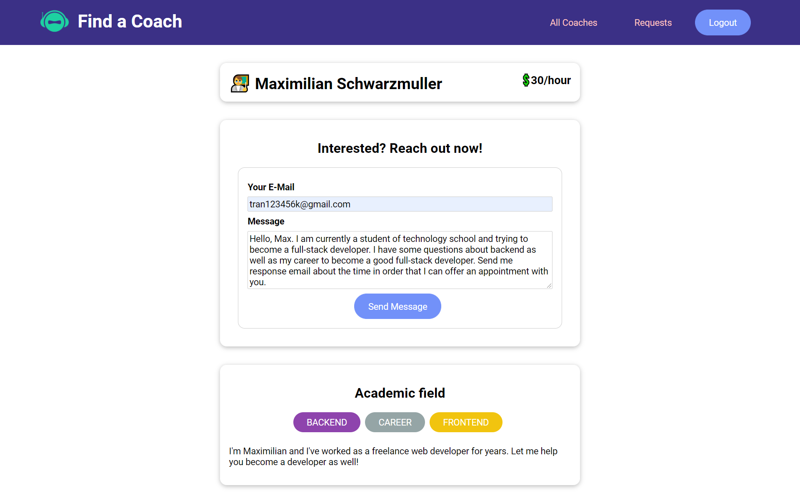
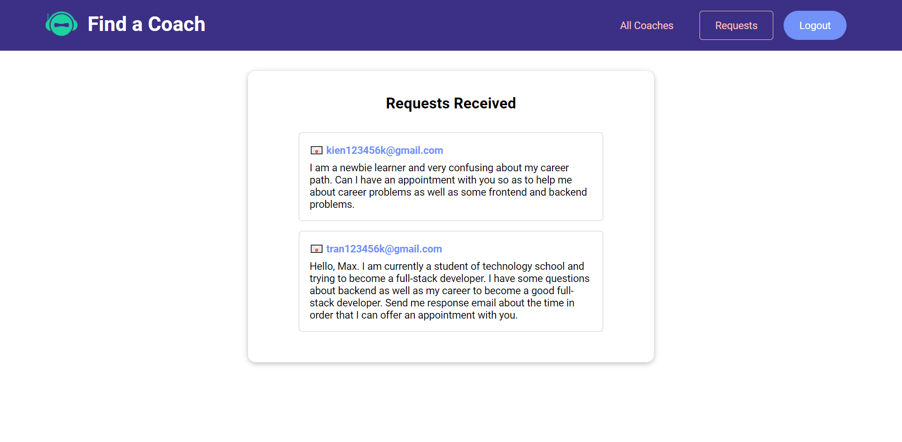

#  Find a Coach 

## [Live Demo](https://youtu.be/B2CjWKQFaiw)
## What is Find a Coach?
- A coach booking application that allow you to find your suitable coach depend on your fields of learning to help you with your career.
- The main purpose of this project is to practice Vue, VueX and Vuex's support ecosystem with its best practice.
- Therefore, this application should be used for production because it's created to be quite simple so as for everyone easy to understand the workflow.
You can consider using Burger Booking for produciton if only you improve it.

## Technology
- Frontend
  - Vue 3 - The Progressive JavaScript Framework
  - Vue CLI - Vue Starter Template
  - VueX - State Management
- Backend
  - Firebase - Authentication, Realtime Database.

**Note:** This application is built with Optional API of Vue 3. Consider to use Composition API if you want your application to grow big.

## Some preview images
&nbsp;
&nbsp;

## Available Scripts
Before jump in to run this application:
- First, remember to create a `.env.local` file with content exactly like `.env.example` file content.
- Then replace  `your_firebase_sign_in_api`, `your_firebase_sign_up_api` and `your_firebase_realtime_db_api` with your  [Firebase](https://firebase.google.com/) API respectively.

In the project directory, you can run:

## Project setup
```
yarn install
```

### Compiles and hot-reloads for development
```
yarn serve
```

### Compiles and minifies for production
```
yarn build
```

### Lints and fixes files
```
yarn lint
```
# License & copyright

© Kirin Tran, FPT University TP.HCM
Licensed under the [MIT LICENSE](LICENSE).